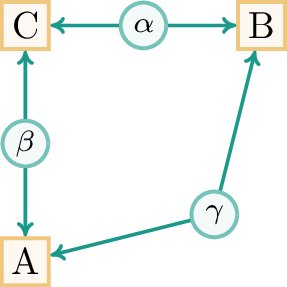
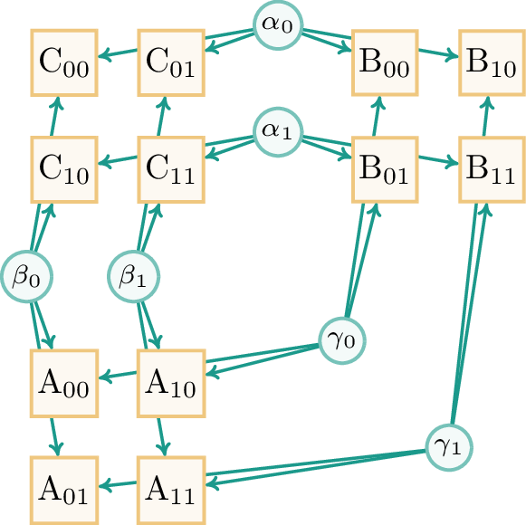

# Fast Inflation

This repository provides the code associated to the paper *Title todo*, Victor Gitton, Renato Renner, *arXiv link todo*.

## Background: triangle nonlocality

The triangle network is a network of three parties, Alice, Bob and Charlie, sharing three bipartite sources, denoted $\alpha$, $\beta$ and $\gamma$.
We depict the triangle network as follows:

    

A distribution $p(a,b,c)$ is said to be classically compatible with the triangle network, or compatible with the classical triangle network, or simply (triangle) **local** for short, if there exist (nonnegative, normalized) response functions $p_A,p_B,p_C$ such that 

$$ p(a,b,c) = \int \text{d}\alpha\hspace{1pt}\text{d}\beta\hspace{1pt}\text{d}\gamma\hspace{1pt} p_A(a|\beta,\gamma)p_B(b|\gamma,\alpha)p_C(c|\alpha,\beta). $$

(The integral over $\alpha,\beta,\gamma$ simply represents the average over the source values, which we can take to be uniformly distributed over the $[0,1]$ interval, for instance.)
Otherwise, the distribution $p(a,b,c)$ is classically incompatible with the triangle network, or simply (triangle) **nonlocal** for short.
For a general review on network nonlocality, see "Bell nonlocality in networks", by Armin Tavakoli, Alejandro Pozas-Kerstjens, Ming-Xing Luo and Marc-Olivier Renou published in Rep. Prog. Phys. 85, 056001 (2022).
See [https://arxiv.org/abs/2104.10700](https://arxiv.org/abs/2104.10700).

### Inflation

To prove nonlocality in the triangle network, we use the technique of inflation, which is a general technique for generating relaxations of causal compatibility problems in classical, quantum or post-quantum theories.
See in particular "The inflation technique for causal inference with latent variables" by Elie Wolfe, Robert W. Spekkens and Tobias Fritz published in J. Causal Inference 7(2), 2019 ([https://arxiv.org/abs/1609.00672](https://arxiv.org/abs/1609.00672)).

In our case, starting from the classical triangle network, consider the following inflation graph, obtained by taking two copies of each source and four copies of each party in the triangle network:

    

The idea of the inflation problems that we consider is the following.
Suppose that a distribution $p$ is local in the triangle network, with associated local model (triplet of response functions) $p_A,p_B,p_C$.
Then, define a distribution $q$ over the outcomes of the parties of the above inflation graph as follows:
- let all the Alices of the inflation graph use the response function $p_A$,
- let all the Bobs of the inflation graph use the response function $p_B$,
- let all the Charlies of the inflation graph use the response function $p_C$,
- let all the sources be distributed as in the original local model, i.e., uniformly over the $[0,1]$ interval.

This distribution $q$ then satisfies a number of *linear* equations:
- Symmetry: $q$ is symmetric under exchanges of the inflation parties that can be "cancelled" by a corresponding exchange of the inflation sources.
- Marginals: some of the marginals of $q$ correspond to the distribution $p$.
  At the level of the inflation graphs, these correspond to subsets of parties that are connected by sources in a triangle-network way, e.g., $A_{11},B_{12},C_{21}$.

Thus, if we can prove that a triangle distribution $p$ does not admit a corresponding inflation distribution $q$ satisfying the appropriate linear constraints, this proves that $p$ is nonlocal.
This is, on the one hand, easy, because whether or not an appropriate distribution $q$ exists is a linear program, a particularly simple class of optimization problems.
On the other hand, the number of variables of the linear program scales, roughly, like $n_{\text{o}}^N$, where $N$ denotes the number of inflation parties, and $n_{\text{o}}$ denotes the number of outcomes per party.
Thus, considering large inflation graphs is difficult, but these are exactly the inflation graphs that better characterize the local set (they provide a tighter outer approximation of the triangle local set, and can thus prove the nonlocality of more distributions).
This is the essence of the convergence result of "The inflation technique completely solves the causal compatibility problem" by Miguel Navascues and Elie Wolfe published in J. Causal Inference 8(1), 2019.
See [https://arxiv.org/abs/1707.06476](https://arxiv.org/abs/1707.06476).

## Code features

The code allows to certify the nonlocality of a distribution $p(a,b,c)$ in the triangle network by proving the incompatibility of $p$ with some inflation problem.
From the user perspective, using the code requires to choose:
- A number of outcome per party, i.e., a number $n_{\text{o}}$ such that Alice, Bob and Charlie have $n_{\text{o}}$ outcomes each.
- An inflation size $z = (z_0,z_1,z_2) \in \mathbb{N}^3$, where $z_0,z_1,z_2$ denote the number of copies of the $\alpha,\beta,\gamma$ sources, respectively.
  In the above inflation graph, the size is $z = (2,2,2)$.
- A set of inflation constraints $\mathcal{C} \subset \text{InfCons}$.
- A target distribution $p(a,b,c)$, specified with rational components.

Then, the code detects the symmetries of the distribution $p$, and using these to speed up the execution time and memory usage without modifying the underlying mathematical problem, returns whether or not the distribution $p$ is compatible or not with the specified inflation problem (inflation size and inflation constraints).
This involves a Frank-Wolfe algorithm for solving the corresponding linear linear program (which is, in this case, a polytope membership problem).
If the distribution $p$ is incompatible with the inflation problem, this proves that $p$ is nonlocal.

At the time of writing, this code is the most computationally efficient tool for certifying triangle nonlocality.

### Exact arithmetic

Importantly, if the code states that the distribution $p$ is nonlocal, this means that a nonlocality certificate was checked in rational arithmetic, so that the assessment of nonlocality is **exact** and does not suffer from numerical imprecision.
We can thus call this a computer-assisted proof of nonlocality.
More precisely, the nonlocality certificate is simply a separating hyperplane in the polytope membership problem that describes the linear program of inflation compatibility.
The polytope membership problem features points that have rational coordinates, and checking the certificate in exact arithmetic just means that we verify in exact (in this case, rational) arithmetic that the certificate indeed separates the point from the polytope.

On the other hand, if the code states that the distribution $p$ is compatible with an inflation problem (which does not imply anything for whether or not $p$ is local), then this means that the distribution $p$ admits a floating-point inflation distribution $q$ that satisfies *up to numerical precision* the specified inflation constraints.
Mathematically speaking, this means that $p$ may or may not be compatible with the inflation problem.

### Future directions

To provide a more extensive computational tool, it would be desirable to extend the codebase to cover the following features:
- Exploit impossible events (zeros in the target distribution) to reduce the set of inflation events and scalar constraints.
- Allow to go beyong the triangle network: for instance, it would be useful to be able to handle the bilocal scenario.

## Documentation  

To use and extend the codebase, please refer to the documentation available at [vgitton.github.io/fast-inflation](https://vgitton.github.io/fast-inflation/index.html).
The HTML documentation can be built locally by running `make doc` (prerequisite : [`doxygen`](https://www.doxygen.nl/manual/index.html)).

## Related repositories

- The [inflation](https://github.com/ecboghiu/inflation) Python package handles general network graphs with classical, quantum or post-quantum sources.
  Its level of generality and user-friendly interface can only be praised.
- The [minimal-triangle-nonlocality](https://github.com/apozas/minimal-triangle-nonlocality) repository contains Matlab scripts that define and solve inflation problems quantum and classical inflation problems.
  We used these results to validate the correctness of our approach.

## Contact

Please contact Victor Gitton at [vgitton@phys.ethz.ch](mailto:vgitton@phys.ethz.ch) for any question/suggestion or regarding help to install, compile, run or extend the codebase.

## Acknowledgments

The automatic C++ makefile is based on [this one](https://gist.github.com/maxtruxa/4b3929e118914ccef057f8a05c614b0f).
The documentation theme we use is [doxygen-awesome-css](https://github.com/jothepro/doxygen-awesome-css).

Special thanks to 
Cristian Emmanuel Boghiu ([ecboghiu](https://github.com/ecboghiu)),
Sébastien Designolle ([sebastiendesignolle](https://github.com/sebastiendesignolle)),
Alejandro Pozas-Kerstjens ([apozas](https://github.com/apozas)),
and Elie Wolfe ([eliewolfe](https://github.com/eliewolfe))
for their support towards this project.

